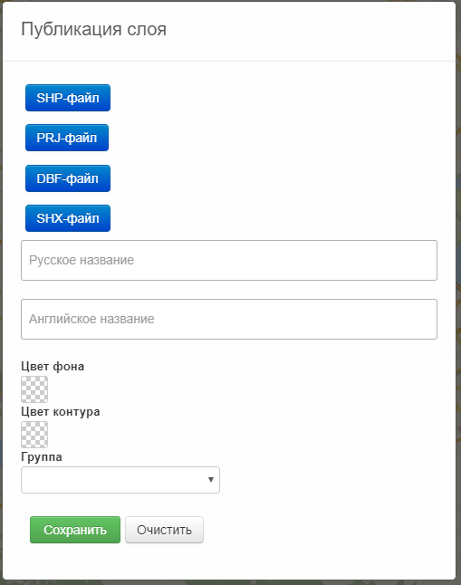
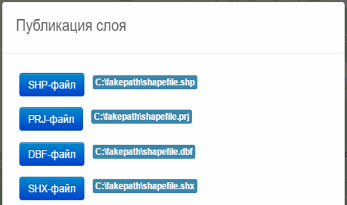
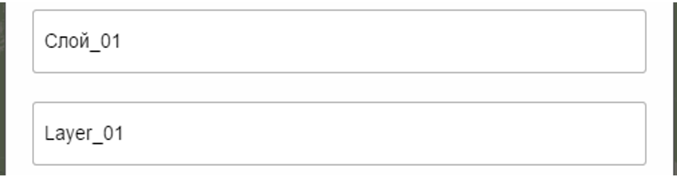
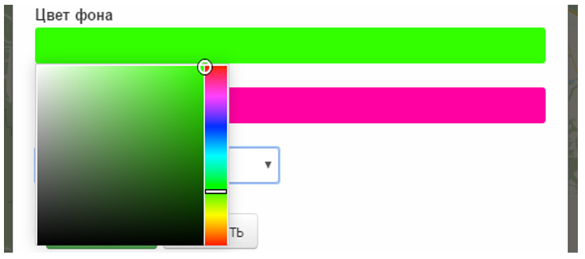

# Библиотека CURL
<h5>Формирование и выполнение HTTP-запросов, на примере метода POST</h5>
<h1>Cодержание</h1>
  <ul>
    <li><a href="#about">В двух словах о модуле...</a></li>
    <li><a href="#curl">Немного о CURL</a></li>
    <li><a href="#task">Задача</a></li>
    <li><a href="#interface">Интерфейс модуля</a></li>
    <li><a href="#work">Работа модуля</a></li>
    <li><a href="#experience">Полученный мною опыт</a></li>
  </ul>
<h2 id="about">В двух словах о модуле...</h2>

  Имеется некий веб-сайт с картой России, на котором необходимо разместить модуль, публикующий некую картографическую информацию (карты посевов и т.п.).

  Осуществеление публикации этой картографической информации происходит на другом сайте.

  Но потребовалось разместить модуль публикации картографической информации именно на веб-сайте с картой России (удобно, когда под рукой можно опубликовать что-либо).

  Интерес в том, что разработанный модуль работает с помощью библиотеки CURL. Фактически осуществляется имитация действий пользователя на другом сайте.

  То есть сервера будут думать, что все запросы идут с одного сайта. Но на самом деле пользователь выполняет их на другом.

<h2 id="curl">Немного о CURL</h2>

  CURL – это библиотека функций PHP, с помощью которой можно посылать запросы, например, HTTP, из PHP скрипта. CURL поддерживает такие протоколы как HTTP, HTTPS, FTP и другие. Посылать HTTP запросы можно методами GET, POST, PUT.

  CURL может пригодиться в случаях когда необходимо вызвать удаленный скрипт и получить результат или просто сохранить HTML код вызываемой страницы, в общем каждый может найти свое применение но смысл один это то что можно послать запросы в процессе выполнения скрипта.

<h2 id="task">Задача</h2>
Разработка и внедрение модуля публикации картографической информации в систему агромониторинга
<h2 id ="interface">Интерфейс модуля</h2>

  Пользователю необходимо выбрать четыре формата, так называемого Shapefile слоя, который, как раз и необходдимо опубликовать. Файлы выбираются с компьютера пользователя.

   Далее следует ввести русское название - оно будет отображаться для пользователя.

   И английское название - оно будет ипользоваться в БД.

   Имеется защита от ввода неправильныйх символов. Если в "русском" поле ввести англиские символы, то модуль также сообщит об этом.

   Цвет фона и контура слоя также выбирается пользователем. Это единственные поля в форме, необязательные для заполнения. Если пользователь решил их пропустить, то по умолчанию цвет фона будет отображаться синим, а окантовка черной.

   Последним обязательным полем для заполнения является выбор группы, к которой будет принадлежать слой.

  При правильно заполненной форме, осуществиться вывод сообщения о выполненной операции. Все сообщения приходят непосредственно от сервера, и если оператором была допущена какая-либо ошибка (например, ввел название слоя, которое уже используется), то в уведомлении об этом допущении сообщит сервер.

<h2 id="work">Работа модуля</h2>

   Публикация картографической информации осуществлена в подсистеме администрирования MapAdmin <b>(это один сайт)</b>. Данный процесс необходимо осуществить в подсистеме MapSurfer <b>(а это как раз веб-сайт с картой России, где и нужно разместить модуль)</b>, который также следует выполнить в автоматизированном режиме. Другими словами, модуль осуществляет имитацию процесса публикации слоя оператором в подсистеме MapAdmin в подсистеме MapSurfer с осуществлением автоматизации, путем выполнения некоторых функции внедренным модулем.

  Так как подсистема MapSurfer является веб-приложением и работает по протоколу HTTP, а модуль публикации внедрен в данную подсистему. Практически при каждом действии оператора в модуле публикации выполняется, так называемый, HTTP-запрос. Это сообщение, которое посылается клиентом (пользователем) серверу.

  HTTP определяет форму и назначение сообщений, которыми обмениваются веб-компоненты (клиент и сервер). Протокол представляет собой принцип «запрос-ответ» - клиент отправляет сообщение-запрос, а затем сервер откликается сообщением-ответом. Клиентские запросы обычно выполняются действиями оператора (щелчок мыши).

  Данные действия, т.е. имитацию процесса публикации, возможно осуществить с помощью библиотеки CURL, которая выполняется с помощью скриптового языка общего назначения, применяемого для разработки веб-приложений под названием PHP. CURL – библиотека функций, позволяющая взаимодействовать с сервером по различным веб-протоколом, в том числе и HTTP. 

  Имитация действий оператора сводится к осуществлению HTTP запросов методами:
  <ul>
    <li>POST – передача данных клиента серверу (заполнение формы);</li>
    <li>GET – запрос содержимого;</li>
    <li>PUT – загрузка содержимого;</li>
    <li>DELETE – удаление содержимого;</li>
  </ul>

  Разработанный модуль осуществляет запросы методом POST. Он используется для запроса сервера, чтобы тот принял информацию, включенную в запрос, а сервер, в свою очередь, отправил ответ клиенту (оператору), исходя из полученных данных. Для публикации слоя необходимо выполнить несколько таких запросов. Принято решение каждый запрос выполнить в отдельных PHP-скриптах, что увеличивает оптимизацию самого модуля и предотвращает процесс зависания при работе.

  При каждом выборе из четырех файлов выполняется POST-запрос, ответом является закодированное наименование файла, которое используется в БД GeoServer. Ответ перехватывается с помощью языка программирования JavaScript.  Осуществляется запрос с использованием технологии AJAX, которая позволяет получить данный наименования без перезагрузки страницы. К тому же AJAX, отправляет закодированные наименования файлов в основной PHP-скрипт, где собираются все введенные данные оператором и осуществляется POST-запрос на публикацию слоя. После выполненной операции оператору придет сообщение от сервера о его результате.

<h2 id="experience">Полученный мною опыт</h2>

  <ul>
    <li>В данной работе я получил опыт работы с PHP;</li>
    <li>Научился работать с библиотекой CURL. Благодаря ему, узнал, как формируются HTTP-запросы;</li>
    <li>Получил опыт работы с JavaScript и изучил технологию AJAX;</li>
    <li>Опыт с HTML и CSS (работа с фреймоврком Bootstrap);</li>
  </ul>

